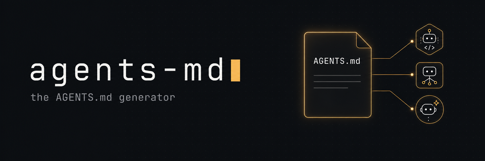

<p align="center">
  
</p>

<h1 align="center">agents-md</h1>

<p align="center">
  <strong>Generate and safely maintain an <a href="https://agents.md">AGENTS.md</a> for any repo. The cross-tool standard that AI coding agents read.</strong>
</p>

<p align="center">
  
  
  
  
  
  
</p>

<p align="center">
  <a href="https://agents.md"></a>
  
  
  
  <a href="https://eugeniughelbur.github.io/agents-md/"></a>
</p>

One `AGENTS.md` works across Codex, Cursor, GitHub Copilot, Gemini CLI, Aider, Windsurf, Zed, Devin, and more. `CLAUDE.md` is pointed at it via symlink. This skill writes a great one for you by reading your repo, and it is **safe to re-run**: it only updates the regions it generated and never clobbers anything you wrote by hand.

> Backed by the standard: AGENTS.md started at OpenAI (2025) and is now under the Linux Foundation's Agentic AI Foundation, used in 60,000+ repositories.

## Why this one

- **Aligned with the standard.** Targets `AGENTS.md`, not a private format only one tool reads.
- **Safe, non-destructive re-runs.** Generated sections are wrapped in HTML-comment markers. Re-running refreshes only those zones. Your hand-written content (and the `## Notes` section) is never touched. If a hand-written `AGENTS.md` already exists with no markers, it is left alone and a `AGENTS.generated.md` is written beside it instead.
- **Never fabricates.** Facts are read from your repo (manifests, scripts, Makefile, git history, CI, `.env.example`). Anything it cannot find is left as a clearly-marked stub for you to fill, never invented.
- **Boundaries-first.** Every file gets the three-tier guardrail (✅ Always / ⚠️ Ask first / 🚫 Never), the section GitHub's analysis of 2,500+ repos found most prevents destructive mistakes.
- **One source, every tool.** Symlinks `CLAUDE.md` (and optionally Cursor / Copilot configs) to the same `AGENTS.md`.

## What it generates

A lean (~200 line) `AGENTS.md` with: Overview, Commands, Testing, Project structure, Code style & conventions, Git workflow, Gotchas, Security & secrets, and a three-tier **Boundaries** section. See [`templates/AGENTS.template.md`](templates/AGENTS.template.md).

## AGENTS.md vs CLAUDE.md vs .cursorrules vs llms.txt

| File | Read by | What it is |
|---|---|---|
| **AGENTS.md** | Codex, Cursor, Copilot, Gemini CLI, Aider, Windsurf, Zed, Devin, and more | The cross-tool standard for agent instructions (Linux Foundation / Agentic AI Foundation) |
| CLAUDE.md | Claude Code | Tool-specific; symlink it to AGENTS.md |
| .cursorrules / .cursor/rules | Cursor | Tool-specific (Cursor also reads AGENTS.md) |
| .github/copilot-instructions.md | GitHub Copilot | Tool-specific (Copilot also reads AGENTS.md) |
| llms.txt | LLMs / AI search engines | For documentation websites, not repo agent instructions |

The convergence: write one **AGENTS.md** and symlink the rest. `agents-md` does exactly that.

## Use it

**As a CLI (any repo, no API key, zero dependencies):**

```bash
cd your-repo
npx github:eugeniughelbur/agents-md
```

It scans the repo, writes or refreshes `AGENTS.md`, symlinks `CLAUDE.md` to it, and reports which sections it filled vs left as stubs for you to complete. Flags: `--dry-run`, `--no-symlink`. Run it again any time, it is a safe refresh, never a reset.

**As a Claude Code skill (LLM-powered, richer):**

```bash
npx skills add eugeniughelbur/agents-md
```

Then run `/agents-md` in any repo. The skill reads your code intelligently and writes deeper content (real gotchas, real boundaries); the CLI is the fast, deterministic, zero-setup option. Both honor the same safe-marker contract.

## The marker contract

```
<!-- agents-md:begin id=commands -->     content here is regenerated on re-run
...
<!-- agents-md:end id=commands -->
```

Everything outside the markers is yours and is preserved forever. Put durable custom notes in `## Notes`.

## FAQ

**What is AGENTS.md?**
AGENTS.md is an open, cross-tool standard file that tells AI coding agents how to work in your repository: its build and test commands, code conventions, gotchas, and do-not-touch boundaries. It originated at OpenAI in 2025 and is now governed by the Linux Foundation's Agentic AI Foundation. Think of it as a README for agents.

**AGENTS.md vs CLAUDE.md, which should I use?**
Use AGENTS.md as the single source, then symlink CLAUDE.md to it. Most agents read AGENTS.md natively; Claude Code reads CLAUDE.md, so the symlink covers both. agents-md sets this up for you automatically.

**How do I generate an AGENTS.md?**
Run `npx github:eugeniughelbur/agents-md` in your repo. It detects your stack, commands, and structure, writes AGENTS.md, and symlinks CLAUDE.md. Anything it cannot detect is left as a clearly marked stub for you to fill in.

**Is it safe to re-run? Will it overwrite my edits?**
Yes, it is safe. Re-runs refresh only the regions wrapped in HTML-comment markers; everything outside the markers is preserved. A handwritten AGENTS.md with no markers is never overwritten, agents-md writes AGENTS.generated.md instead.

**Does it need an API key or send my code anywhere?**
No. The CLI has zero dependencies, makes no network calls, and reads only repo metadata (and `.env.example`, never real secret values).

## License

MIT

---

<p align="center"><strong>Built by Eugeniu Ghelbur.</strong> If agents-md kept an AI agent from breaking your repo, a ⭐ helps others find it.</p>

<p align="center">
<a href="https://x.com/eugeniu_ghelbur"></a>
<a href="https://www.linkedin.com/in/eugeniu-ghelbur/"></a>
<a href="https://theaioperator.io"></a>
<a href="https://github.com/eugeniughelbur"></a>
</p>

